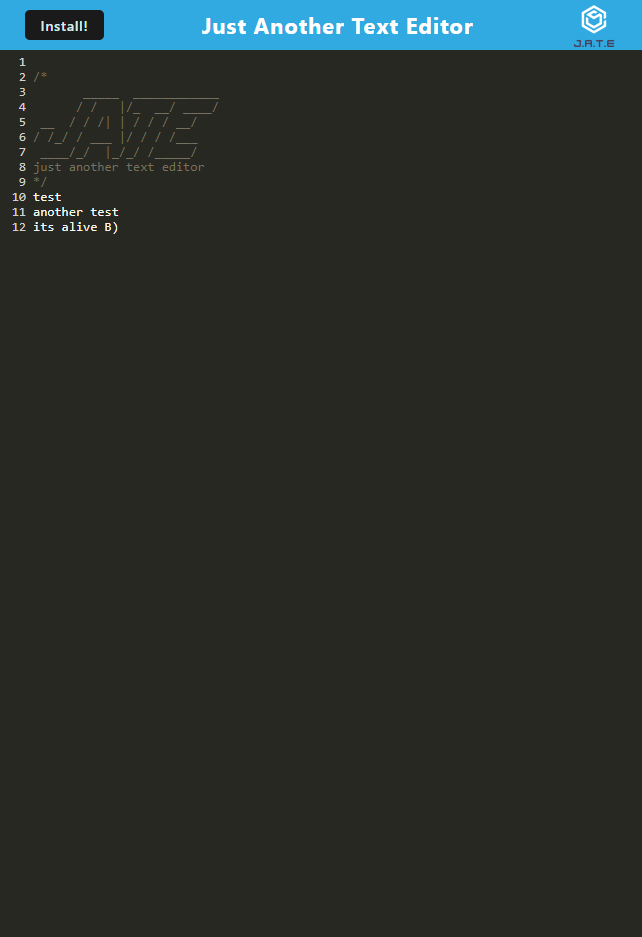

# JATE-Text-Editor

[](https://opensource.org/licenses/other)

## Description

An app to write text that will persist. Also is a PWA that can be downloaded by hitting the download button.

## Table of Contents (Optional)

- [Installation](#installation)
- [Usage](#usage)
- [Questions](#questions)

## Installation

To install necessary depenencies, run the follwing command:

```md
npm i
```

## Usage

To use, write whatever you like in the fields. If you would like to download it, you can click on the install button. Also can be accessed through the provided heroku link.

https://bradleys-text-editor.herokuapp.com/



## How to Contribute

Feel free to contribute however you like.

## Tests

n/a

## Questions?

Reach out to me!

-GitHub: [HeyItsKito](https://github.com/HeyItsKito)

-Email: bradleyrodriguez77@gmail.com
